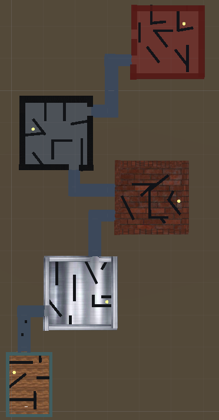
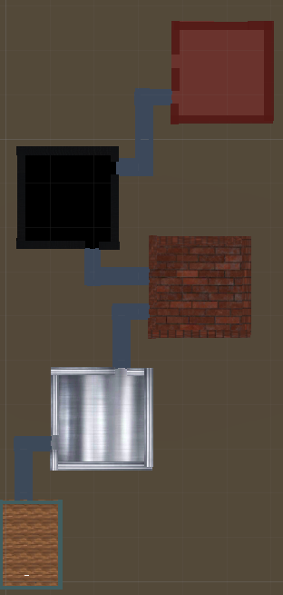
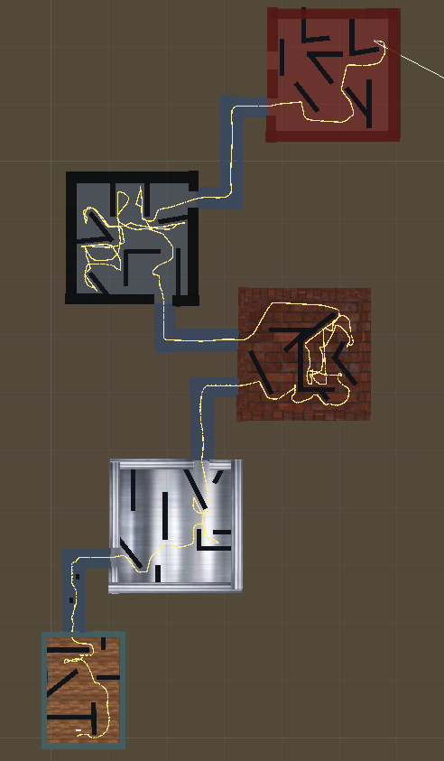

**590FinalProject**
---------------------------------
UNC-590 Audio Propagation Final Project

Our group made a virtual environment made of 5 rooms with varying materials (wood, metal, brick, carpet, and glass) and put several invisible walls into the scene. The users were tasked with finding 5 invisible audio sources throughout the VE talking as few steps as possible (we emphasized to both groups that the goal is to take as few as steps, not take the least amount of time). We had two groups in our study: one group with a 'beacon' that we made to help navigate the VE and the other group without the 'beacon'. The 'beacon' was simply a ball that was launched from the position of the user and propagated audio when hitting an invisible wall or the floor. Our hypothesis was the group with the 'beacon' would be able to navigate the room better (aka take the fewest number of steps) then the group without it. 

Research paper link:
------------------------
https://docs.google.com/document/d/1TkO7MzRMJ70VhO8k7_j5pByBQ3LUiwx7FU1ZxAgL8-I/edit?usp

VE (invisible walls and audio sources are shown):
--------------------------------

VE (invisible walls not shown):
------------

Steps taken from user with beacon (invisible walls shown):
-----

Team Members:
-------
 <a href="https://github.com/haliechm" target="_blank">**Halie Chmura**</a> | <a href="https://github.com/mbeganovic3" target="_blank">**Meris Beganovic**</a> | <a href="https://github.com/heyaitsbea" target="_blank">**Bea Manaligod**</a> |
 <a href="https://github.com/ljenloe" target="_blank">**LJ Enloe**</a> 

